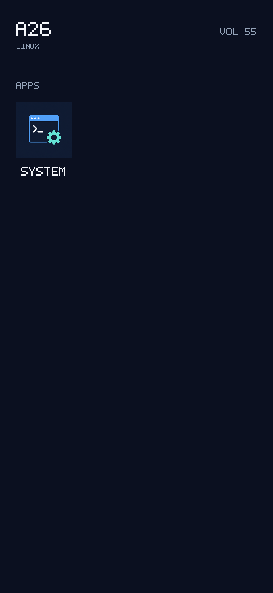
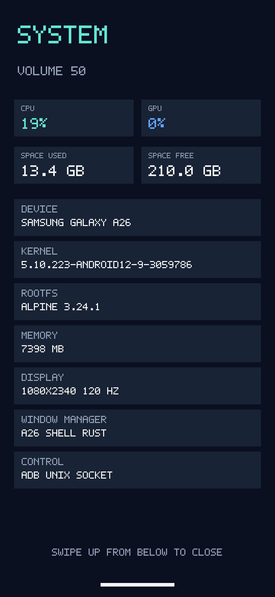

# A26 Shell design notes

A26 Shell is a minimal Rust phone shell/window manager targeting native Xorg on
the Samsung Galaxy A26 (SM-A266M).

## Current interface

- numeric lock screen;
- minimal app-grid launcher with generated System artwork;
- exact one-physical-pixel app-icon frame;
- no on-screen lock button—the physical power key locks and blanks the panel;
- no gesture bar on the launcher;
- separately managed `a26-system` application with device/Linux information,
  live CPU/GPU utilization, and used/remaining filesystem space;
- bottom-edge gesture bar inside System, where swiping up closes the app;
- volume overlay and root-only ADB/Unix-socket development controls.
- global Moon-owned on-screen keyboard in a dedicated X11 window, with XTEST
  delivery to the focused managed app and a key-free bottom close zone.

## Captured output

These images were captured from the actual X11 shell window with the included
`a26-shellshot` utility rather than through Android SurfaceFlinger.

### Launcher

### System app

Pixel-level layout checks are recorded in
[`ui-redesign-verification.txt`](ui-redesign-verification.txt).

## Verified development behavior

- Xorg window size: 1080x2340
- XInput 2.2 raw touch begin/update/end decoding
- lock-screen keypad hit testing
- System app launch and bottom-edge close gesture
- normal X11 app window mapped fullscreen and terminated on close/power lock
- power-off lock, backlight zero, and lock-only wake
- safe WM restart while the panel is blanked
- root-only control socket and configuration permissions
- static aarch64-musl build
- keyboard layout/hit-test, state-transition, password-redaction, and lock
  gating unit tests

The lock screen is intentionally only a session UI. The reference development
device has an unlocked bootloader, root, and authorized ADB, all of which can
bypass the shell.
